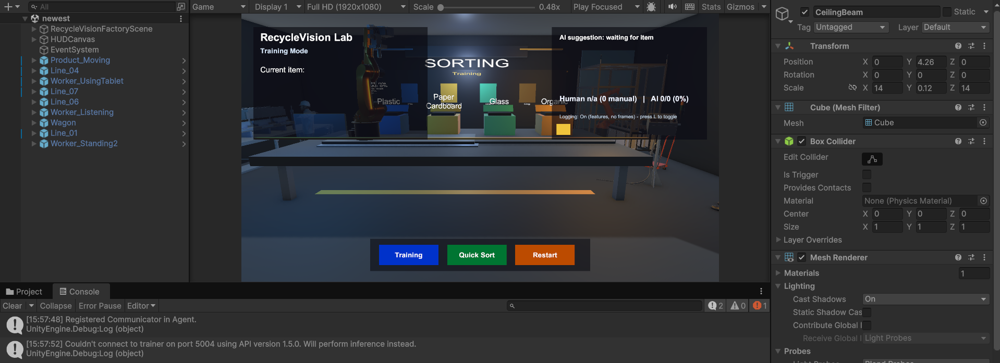
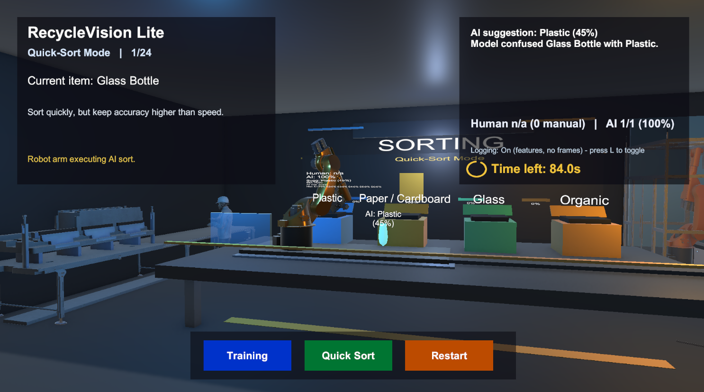
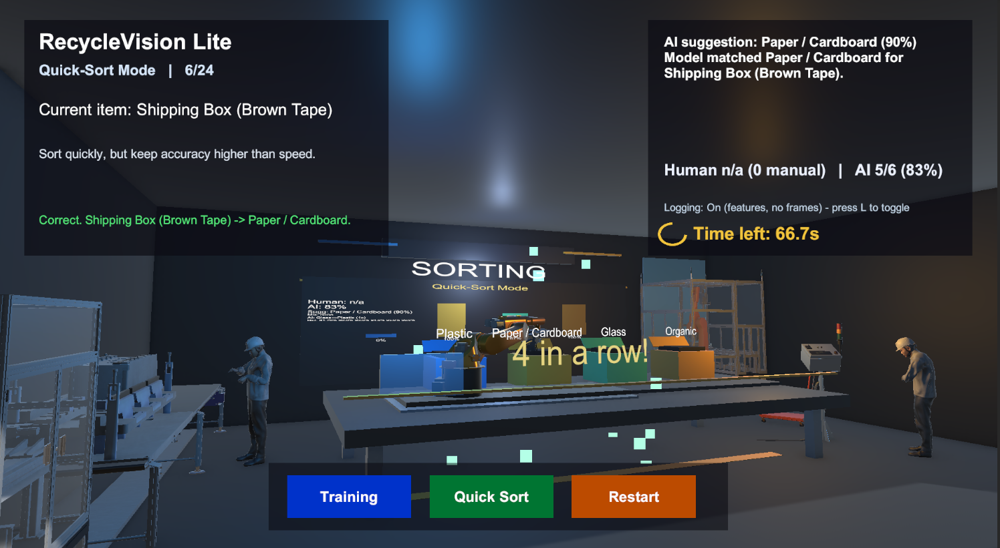
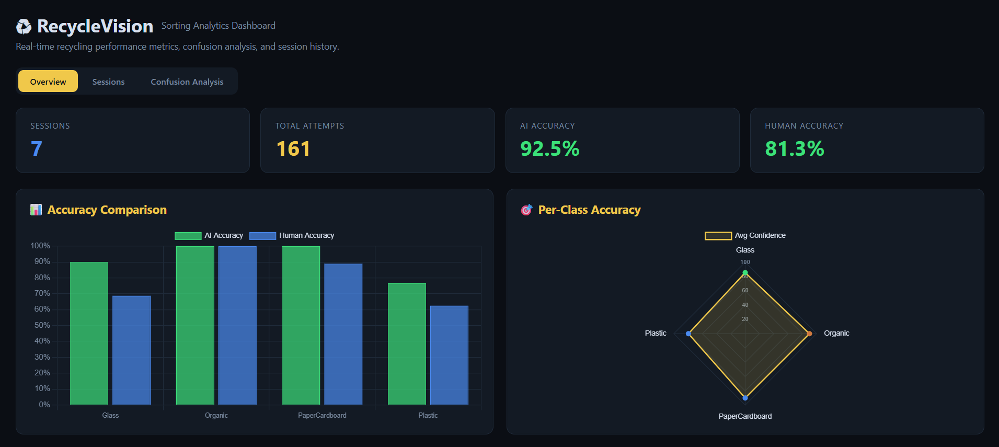
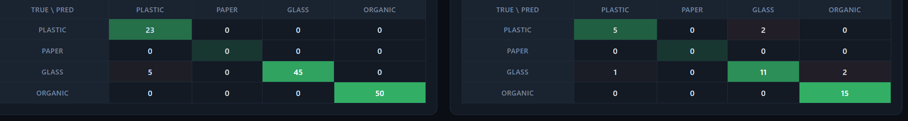
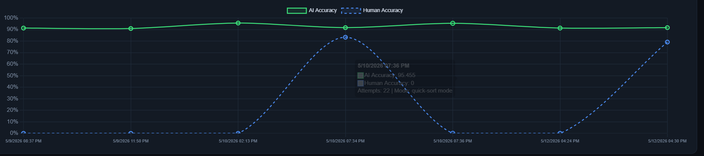

# RecycleVision Lite

<div align="center">
  
</div>

RecycleVision Lite is a 3D household recycling sorting assistant made in Unity, using **Unity ML-Agents**.

The goal of this project is to teach users how to correctly sort everyday household waste into the proper recycling bins. It was built with an interactive scene, immediate feedback, and machine learning components that simulate AI suggestions and automatic sorting.

## Key Features

- **Training Mode**: Users manually sort items while learning from immediate AI predictions and feedback.
- **Quick Sort Mode**: Faster, automatic sorting utilizing a pre-trained ML-Agents policy to simulate robot sorting.
- **Unity ML-Agents**: Uses an **84x84 RGB CameraSensor** and a visual encoder (with additional item features) to output discrete decisions mapping to sorting categories (Plastic, Paper/Cardboard, Glass, Organic).
- **Backend Analytics**: Integrates with a local FastAPI backend. Logs session statistics such as true category, chosen category, predicted category, confidence, and observation vectors for post-session data analysis!
- **Data Dashboard**: Real-time update displays AI vs Human accuracy, mistake patterns (confusion matrix), and time metrics.

## Sorting Categories
- 🟦 Plastic
- 🟨 Paper / Cardboard
- 🟩 Glass
- 🟧 Organic

## Tech Stack
- **Engine**: Unity 3D
- **AI/ML**: Unity ML-Agents Framework (CameraSensor, simple CNN visual encoder)
- **Backend API**: Python, FastAPI
- **Data Storage**: SQLite / Local JSON logs

## Setup & Running 
1. Open the project in Unity.
2. Select the main scene: `Assets/Scenes/newest.unity`
3. (Optional) Run the local FastAPI backend to receive stats:
   ```bash
   cd backend
   .\run_backend.ps1
   ```
4. Start the Unity scene.

*Note: Models and configurations for the ML agent can be found in `Assets/RecycleVision/Models/RecycleVisionSorter.onnx`*

## Gallery & Demonstration

Here are some screenshots demonstrating the project features, modes, and the analytics dashboard. 

*(Please save your 6 chat images into the `screenshots` folder with the names below so they appear on GitHub)*

### 1. Main Sorting Station


### 2. Training Mode


### 3. Quick Sort Mode


### 4. Setup & Analytics Dashboard


### 5. Confusion Matrix (AI Mistakes Analysis)


### 6. Session Statistics & Tracking
